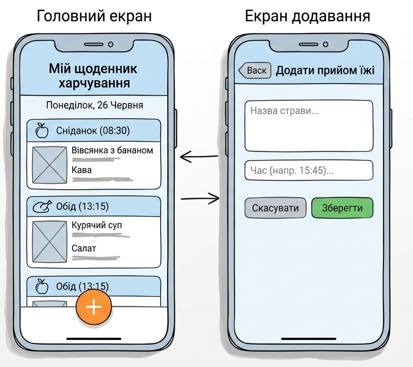

# Лабораторна робота №3: SDLC — Щоденник харчування
**Варіант 24:** Щоденник харчування (запис того, що студент їв за день).

## 1. Планування
**Мета:** Користувач повинен мати можливість швидко фіксувати спожиті протягом дня страви та напої, щоб відстежувати свій раціон харчування.

## 2. Аналіз вимог (User Stories)
1. Як користувач, я хочу додавати прийом їжі (назву страви та час), щоб вести облік харчування за день. ✅ (Must have)
2. Як користувач, я хочу бачити список усіх спожитих страв за поточний день, щоб аналізувати свій раціон. ✅ (Must have)
3. Як користувач, я хочу видаляти випадково доданий прийом їжі, щоб підтримувати актуальність списку.
4. Як користувач, я хочу вказувати орієнтовну розмірність порції (наприклад, "грамів" або "порція"), щоб точніше розуміти обсяг спожитого.
5. Як користувач, я хочу очищати щоденник на новий день, щоб починати відстеження заново.

## 3. Дизайн (Прототип)



*Опис екранів:*
- **Головний екран:** Заголовок "Моє харчування за сьогодні", список вже доданих страв із зазначенням часу та кнопка "+ Додати страву".
- **Екран додавання:** Текстове поле для назви страви, поле для часу/порції та кнопка "Зберегти".

## 4. Реалізація (Псевдокод)
Псевдокод функції додавання запису про прийом їжі:

```pseudo
function addMeal(mealName, mealTime):
    if mealName is empty:
        return "Помилка: Назва страви не може бути порожньою"
    else:
        newMeal = createMealRecord(mealName, mealTime)
        dailyFoodLog.add(newMeal)
        return "Запис успішно додано"
```
## 5. Тестування
1. **Успішне додавання:** Введення "Вівсянка з бананом" о 08:30 → запис з'являється у списку за день.
2. **Перевірка на порожнє поле:** Спроба зберегти запис без назви страви → система видає помилку "Назва страви не може бути порожньою".
3. **Видалення запису:** Натискання кнопки видалення напроти страви "Кава" → запис зникає зі списку за день.

## 6. Висновки
Для розробки цього проєкту найкраще підходить модель **Agile (Scrum/Kanban)**. Оскільки це простий щоденник, Agile дозволяє швидко створити базовий функціонал (MVP), а надалі поетапно додавати нові функції — наприклад, підрахунок калорій, графіки або нагадування про прийоми їжі — на основі відгуків користувачів.
